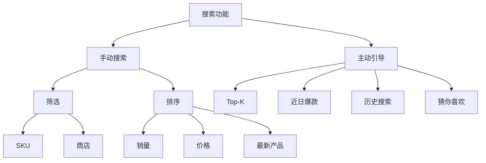
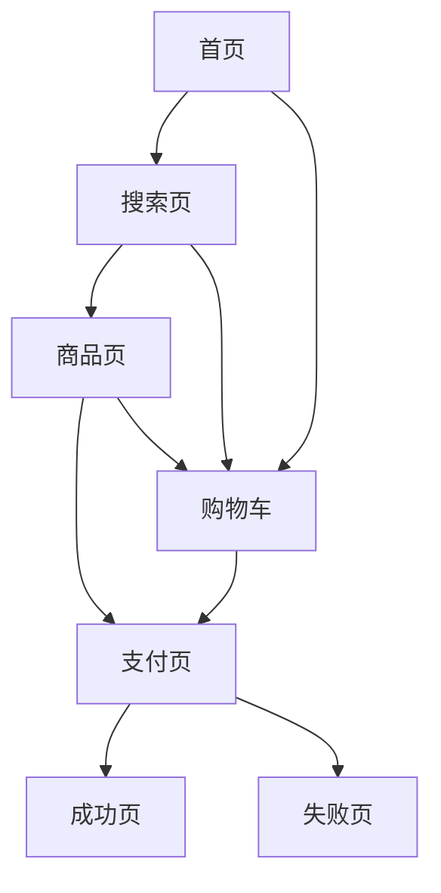

### 1 核心体验图
``` text
找商品 -> 了解 -> 下单 -> 收款
首页 转化% 详情页 %     % 
```

### 2 产品模块图
```text
导购：home search detal ...
交易：支付 售后 ...
营销： 优惠券 积分 拼团 ...
```

### 3 产品功能树



### 4 页面关系图




### 5 mock up （交互图）